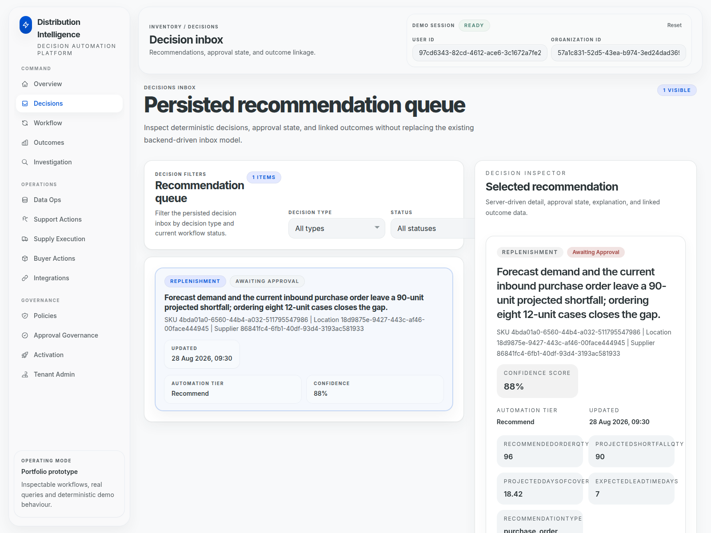
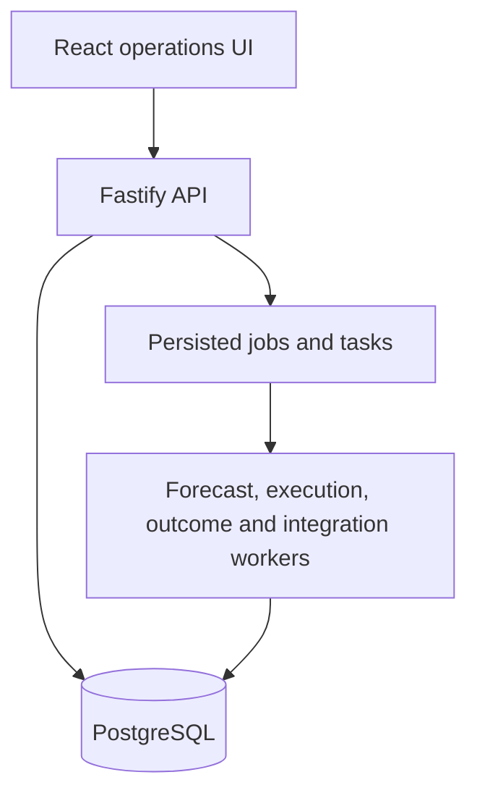

# Distribution Intelligence

A portfolio-grade full-stack prototype for multi-tenant inventory operations. It connects demand signals, stock positions, replenishment decisions, approval workflows, execution retries and measurable outcomes in one operational interface.

> **Project status:** working prototype, not a production service. Authentication uses explicit demo headers, AI defaults to a deterministic mock provider, and ERP/WMS integrations are adapter-based demonstrations.

## Working demo

The Decision Inbox below is captured from a repeatable GitHub Actions run. The workflow provisions PostgreSQL, applies every migration, seeds tenant-scoped demo data, starts the API and React interface, and captures the running application in a browser.



The selected recommendation records a 90-unit projected shortfall, rounds the proposed order to 96 units using a 12-unit case pack, assigns an 88% confidence score and routes the decision to human approval. The scenario is deterministic demo evidence rather than customer or production data. See the [screenshot workflow](.github/workflows/screenshots.yml) and [CI workflow](.github/workflows/ci.yml).

## What this repository demonstrates

- TypeScript API built with Fastify, Prisma and PostgreSQL
- tenant-scoped data access and role-based permissions
- inventory, demand, forecasting and supply workflows
- approval, override, retry and dead-letter handling
- audit events, outbox events and structured logging
- schema-validated AI workflows with deterministic fallback behaviour
- React operations UI with 14 task-focused routes
- unit and PostgreSQL-backed integration tests

## Architecture



## Repository layout

| Path | Purpose |
| --- | --- |
| `apps/api` | Fastify API, Prisma schema, migrations, workers and tests |
| `apps/web` | React, Vite and Tailwind operations interface |
| `docs/runbooks` | Recovery and operational workflow notes |
| `.github/workflows/ci.yml` | Repeatable API, web and PostgreSQL integration checks |

## Local setup

Requirements: Node.js 22+, npm and Docker.

1. Start PostgreSQL:

   ```bash
   docker compose up -d postgres
   ```

2. Configure and start the API:

   ```bash
   cd apps/api
   cp .env.example .env
   npm ci
   npm run prisma:generate
   npm run prisma:migrate:deploy
   npm run bootstrap:demo
   npm run dev
   ```

   The seed command prints the demo user and organisation IDs used by the UI.

3. In another terminal, start the web app:

   ```bash
   cd apps/web
   cp .env.example .env
   npm ci
   npm run dev
   ```

4. Open the Vite URL and enter the printed IDs in the session panel.

## Verification

```bash
npm run typecheck
npm run build
npm test
```

The default root test command runs the API unit suite without requiring a database. GitHub Actions also starts PostgreSQL, applies every migration and runs the integration suite.

## Honest scope

This repository is designed to make the implemented engineering work inspectable:

- demo authentication is intentionally not production identity management;
- the default AI provider is deterministic and local so workflows remain testable;
- CSV and manual-bridge paths are demonstrable, while ERP/WMS adapters are controlled mocks;
- Stripe-facing code exists behind configuration, but no live payment claim is made;
- metrics are process-local and intended for prototype diagnostics.

## Security

No credentials are committed. Copy the supplied `.env.example` files and keep real values in ignored local `.env` files. See [SECURITY.md](SECURITY.md) for responsible reporting.

## Author

Built by [David Szkiba](https://szkibadavid.com) as a systems-focused portfolio project.
